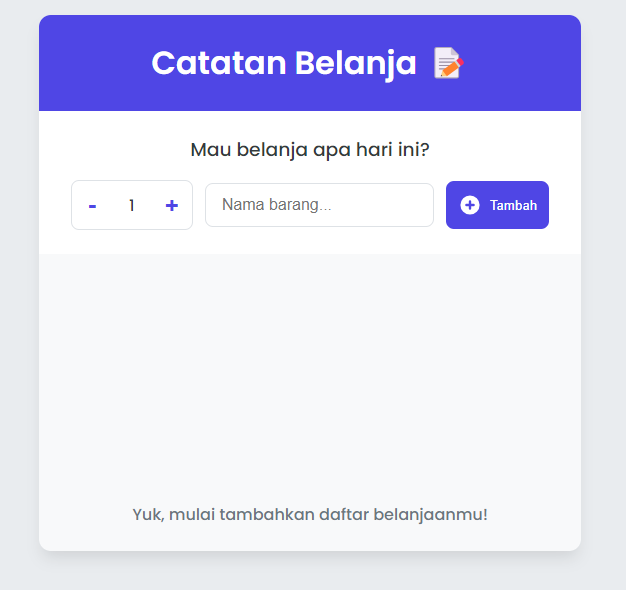

# Grocery List App / Catatan Belanja

.

Aplikasi **"Catatan Belanja" (Grocery List)** yang interaktif dan modern. Dibuat sebagai Single-Page Application (SPA) menggunakan React, tujuannya adalah untuk memberikan pengguna pengalaman yang mulus dan cepat dalam membuat, mengelola, dan melacak daftar belanjaan mereka tanpa perlu me-refresh halaman.

---

## ✨ Fitur Utama

- **📝 Tambah Barang Baru:** Menambahkan barang ke dalam daftar dengan menentukan nama dan jumlah.
- **✔️ Tandai Barang:** Memberi tanda centang pada barang yang sudah dibeli, yang akan mengubah tampilannya secara visual.
- **🗑️ Hapus Barang:** Menghapus item satu per satu dari daftar.
- **🔀 Urutkan Daftar:** Mengurutkan daftar belanjaan berdasarkan urutan input, nama barang (abjad), atau status ceklis.
- **🧹 Bersihkan Daftar:** Menghapus semua barang dari daftar dengan satu klik (dengan dialog konfirmasi).
- **📊 Lacak Kemajuan:** Melihat statistik ringkas berupa progress bar dan teks persentase tentang berapa banyak barang yang sudah dibeli.

---

## 🛠️ Teknologi yang Digunakan

- **⚛️ React.js:** Library JavaScript untuk membangun antarmuka pengguna berbasis komponen.
- **JSX:** Sintaks yang memungkinkan penulisan HTML di dalam JavaScript.
- **Modern CSS:** Styling dengan fitur-fitur modern seperti Flexbox, CSS Variables untuk theming yang mudah, dan desain yang responsif.
- **React Icons:** Library untuk menyertakan ikon populer ke dalam proyek dengan mudah.

---

## 🚀 Cara Menjalankan Secara Lokal

Untuk menjalankan proyek ini di komputer Anda, ikuti langkah-langkah berikut:

1.  **Clone repository ini:**

    ```bash
    git clone [URL-repository-Anda]
    ```

2.  **Masuk ke direktori proyek:**

    ```bash
    cd [nama-folder-proyek]
    ```

3.  **Install semua dependency yang dibutuhkan:**

    ```bash
    npm install
    ```

4.  **Jalankan aplikasi di mode development:**
    ```bash
    npm start
    ```
    Aplikasi akan terbuka secara otomatis di browser Anda pada alamat `http://localhost:3000`.

---

## 🏗️ Arsitektur & Struktur Komponen

Aplikasi ini menggunakan pola arsitektur React yang umum dan efisien, yaitu **"State diangkat ke atas" (Lifting State Up)** atau dikenal juga sebagai **"State Down, Actions Up"**.

- **`App.jsx`**: Komponen induk yang menjadi "otak" aplikasi.

  - Memegang state utama (daftar `items`).
  - Mendefinisikan semua fungsi untuk memanipulasi state (`handleAddItem`, `handleDeleteItem`, dll).

- **`Header.jsx`**: Komponen presentasional untuk menampilkan judul.

- **`Form.jsx`**: Mengelola form input untuk menambah barang baru. Memiliki state lokal untuk input field dan mengirimkan data barang baru ke `App.jsx`.

- **`GroceryList.jsx`**: Menampilkan seluruh daftar belanjaan.

  - Menerima daftar `items` dari `App.jsx`.
  - Memiliki state lokal untuk logika pengurutan (`sortBy`).
  - Melakukan _mapping_ pada data `items` untuk me-render setiap komponen `Item`.

- **`Item.jsx`**: Merepresentasikan satu buah barang dalam daftar. Bertugas menampilkan nama, jumlah, dan tombol interaktif (checkbox & hapus).

- **`Footer.jsx`**: Menampilkan statistik ringkasan (jumlah total, barang yang sudah dibeli, dan persentase) berdasarkan data `items` yang diterima dari `App.jsx`.

Arsitektur ini memastikan alur data yang jelas dan membuat aplikasi lebih mudah untuk di-debug dan dikembangkan lebih lanjut.
